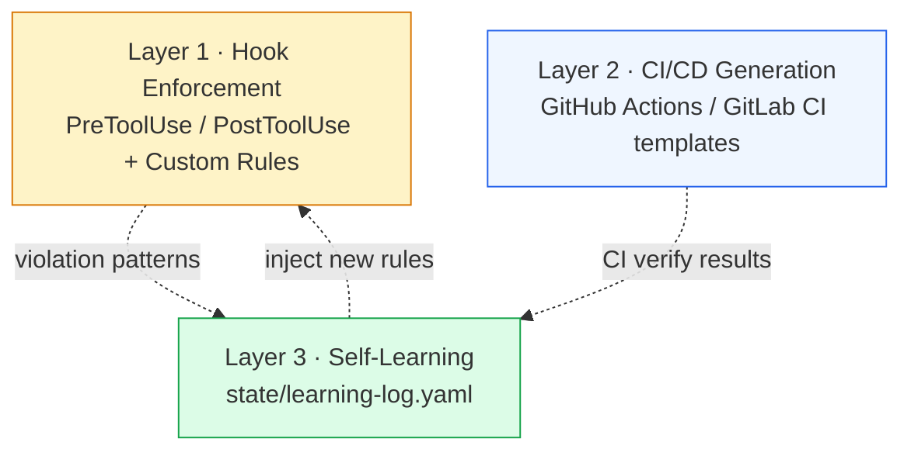

# Project Instructions

## Git Identity

All commits and pushes on this repo MUST be authored as `aiAgentDevelop`, not any
other local identity (e.g. `treenod-scott`). The repo-local `user.name` /
`user.email` are already set — verify with `git config --local user.name` before
committing. If a fresh clone is needed, re-apply:

```bash
git config user.name  aiAgentDevelop
git config user.email 160493288+aiAgentDevelop@users.noreply.github.com
```

Do NOT change the global git identity. Only the repo-local config should be
overridden — other projects on the machine must continue using their own
identities.

## Documentation Rule

Every code change MUST include corresponding updates to both `README.md` and `README-ko.md`.

- New features, options, or wizard steps must be documented in both files
- Changed file structures must be reflected in the Plugin Structure section
- New skills or commands must be added to the Usage section
- Comparison table must be updated if the change differentiates from revfactory/harness
- Both README files must stay in sync — never update one without the other

## Project Overview

harness-marketplace is a Claude Code plugin that generates project-specific development pipeline harness skills via an interactive wizard.

### Key Architecture

- `skills/wizard/SKILL.md` — Main wizard with 3 entry modes (Deep Interview, Manual, Auto-Detect)
- `skills/upgrade/SKILL.md` — Template upgrade preserving config + Custom Rules
- `skills/ci-cd/SKILL.md` — Standalone CI/CD configuration
- `templates/` — Harness skeleton templates (skills, hooks, CI/CD workflows, self-learning)
- `data/` — YAML option catalogs driving wizard questions
- `scripts/` — Validation and hook merge utilities

### Three Layers

1. **Hook Enforcement** — Claude Code hooks (PreToolUse/PostToolUse) for code-level guards
2. **CI/CD Generation** — GitHub Actions / GitLab CI workflow templates
3. **Self-Learning** — Harness evolves by adding hook rules from regression patterns

### State Management

All runtime state of the **generated** harness is file-based under `state/` (no external dependencies, no omc). Layout:

```text
state/pipeline-state.json    Pipeline execution state
state/handoffs/              Phase handoff files
state/results/               Phase result files
state/learning-log.yaml      Self-learning history
```

(These paths live inside the user's project after wizard completion — they do not exist in this plugin repo itself.)

## Three-layer overview (visual)

The harness this plugin generates is the composition of three independent layers. Self-learning closes the loop by feeding violations back into hook rules.



Full data-flow + module-dependency diagrams: see [`docs/ARCHITECTURE.md`](docs/ARCHITECTURE.md).

## Common modification patterns

**Why** this section exists: 가장 흔한 변경 시퀀스를 명시해 두면 신규 컨트리뷰터/agent 가 변경 영향 범위를 즉시 추정할 수 있다.

- **새 wizard 옵션 추가** — `data/<catalog>.yaml` 에 entry 추가 → `skills/wizard/SKILL.md` 의 질문 시퀀스 갱신 → `templates/` 출력에 영향 가는 경우 매핑 갱신 → `scripts/validate-harness.js` 의 스키마 룰 추가. **Note**: `_ko` 라벨 누락 금지 ([ADR-003](docs/adr/003-korean-labels-direct.md)).
- **새 SKILL.md (skills/<name>/) 추가** — 디렉토리 + SKILL.md 신설 → `plugin.json` 의 `skills` 필드에 등록 → README + README-ko 양쪽에 사용 예시 추가 → CHANGELOG `[Unreleased]` 갱신.
- **Template 변경** — `templates/<file>` 편집 → `skills/upgrade/SKILL.md` 의 overwrite 룰 영향 검토 (Custom Rules 마커 위치 보존 필수) → `scripts/validate-harness.js` 의 `REQUIRED_FILES` / `CONDITIONAL_FILES` 동기.
- **Version bump (release)** — `plugin.json` + `marketplace.json` + `package.json` 세 곳 동시 갱신 ([ADR-005](docs/adr/005-version-three-place-sync.md)) → CHANGELOG `[Unreleased]` 를 release section 으로 promote → git tag.

## Cross-module dependencies

전체 의존성 그래프는 [`docs/ARCHITECTURE.md`](docs/ARCHITECTURE.md) 의 mermaid 참조. 빠른 참조용 요약:

- `data/*.yaml` (옵션 카탈로그) → `skills/wizard`, `skills/upgrade`, `skills/ci-cd` 가 공통 소비.
- `templates/` (skeleton) → `skills/wizard` (생성), `skills/upgrade` (재생성).
- `scripts/validate-harness.js` → `skills/wizard` 와 `skills/upgrade` 양쪽 머지 직전 게이트로 호출됨.
- `benchmarks/` → wizard / upgrade 의 효과를 정량 측정하는 메타-도구.

**Important**: 한 파일 변경이 위 chain 의 어느 단계에 영향 가는지 확인하지 않으면 다른 SKILL.md 가 stale 한 reference 를 들고 있게 됨. 변경 전 [`docs/ARCHITECTURE.md`](docs/ARCHITECTURE.md) 의 dependency 표 한 번 확인 권장.

## See also

- [`MEMORY.md`](MEMORY.md) — repo-level 의사결정 / 함정 모음 (1차 컨텍스트)
- [`docs/ARCHITECTURE.md`](docs/ARCHITECTURE.md) — 시스템 다이어그램 (data flow / 3-layer / module deps)
- [`docs/adr/`](docs/adr/) — 결정 근거 (ADR-001 ~ 005)
- [`CHANGELOG.md`](CHANGELOG.md) — release history
