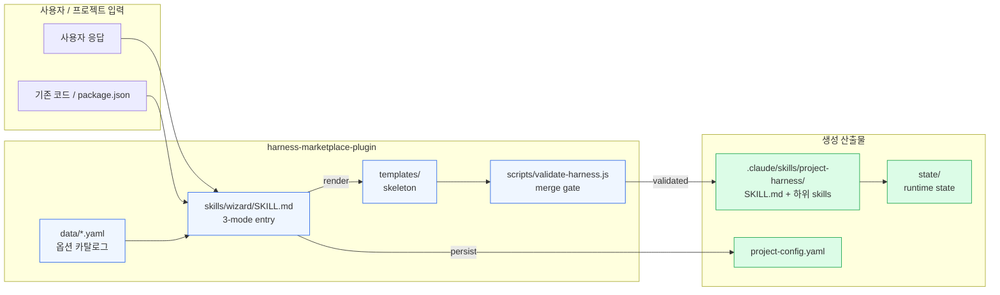
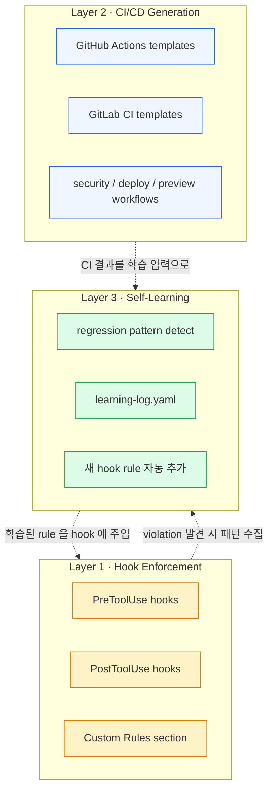
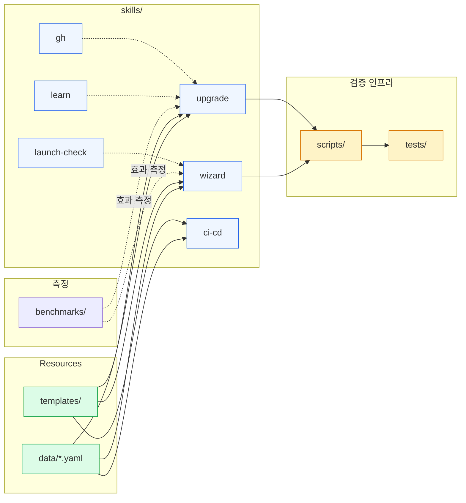

# Architecture

`harness-marketplace-plugin` 의 모듈 / 데이터 플로우 / 의존성 지도. 신규 컨트리뷰터·에이전트 모두 변경 영향 분석 시 이 문서를 1차 참조.

## Overview

이 plugin 은 사용자 프로젝트의 `.claude/skills/project-harness/` 위치에 **development-pipeline harness 스킬을 생성**하는 메타-도구다. 따라서 두 종류의 시스템이 공존:

- **Plugin 자체** (이 레포) — wizard / upgrade / launch-check / ci-cd / gh / learn 의 6개 SKILL.md 와 templates / data / scripts 로 구성
- **Generated harness** (사용자 레포 안) — wizard 가 출력한 result. 사용자 작업의 매 phase 에서 동작.

본 문서는 둘 다 다룬다.

## High-level data flow

Wizard 가 사용자 프로젝트에 harness 를 생성하는 전체 플로우:

`skills/upgrade` 는 동일한 templates / data 를 다시 읽어 사용자 레포의 harness 를 갱신하되, `project-config.yaml` 과 hook Custom Rules / state 는 보존한다.

## Three-layer architecture

이 plugin 이 만들어내는 harness 는 세 개 layer 의 합:

세 layer 는 독립적으로 동작하지만 self-learning 이 hook layer 를 시간에 따라 강화한다. CI 결과 (특히 verify phase 의 issue) 가 self-learning 의 입력.

## Module dependency graph

이 레포 내부의 8 개 module 간 의존 관계:

**해석**:
- `data/*.yaml` 은 wizard / upgrade / ci-cd 의 공통 입력 — 옵션을 추가하면 셋 다 갱신 가능성.
- `templates/` 도 동일.
- `scripts/validate-harness.js` 는 wizard / upgrade 의 머지-게이트.
- `benchmarks/` 는 wizard / upgrade 의 효과를 측정하는 메타-도구.
- `launch-check` / `learn` / `gh` 는 wizard 가 생성한 harness 가 사용하지만, plugin 측에서는 wizard / upgrade 의 보조 skill.

## Cross-module dependencies (text summary)

| 변경 위치 | 영향받을 가능성 큰 다른 위치 |
|---|---|
| `data/agents.yaml` 또는 `data/guides.yaml` 옵션 추가 | `skills/wizard/SKILL.md` (질문 추가), `skills/upgrade/SKILL.md` (재생성 룰), `scripts/validate-harness.js` (스키마 검증) |
| `templates/` 트리에 새 파일 | `skills/wizard/SKILL.md` (출력 매핑), `skills/upgrade/SKILL.md` (overwrite 룰), `scripts/validate-harness.js` (REQUIRED_FILES) |
| `scripts/validate-harness.js` 검증 룰 | `skills/wizard/SKILL.md` 와 `skills/upgrade/SKILL.md` 가 호출 — 룰 변경이 양쪽의 머지-게이트 통과율에 영향 |
| `.claude-plugin/plugin.json` version 변경 | `marketplace.json` + `package.json` + `CHANGELOG.md` 동시 갱신 ([ADR-005](adr/005-version-three-place-sync.md)) |
| README.md 변경 | `README-ko.md` 동시 갱신 ([CLAUDE.md](../CLAUDE.md) Documentation Rule) |

## See also

- [`../MEMORY.md`](../MEMORY.md) — 의사결정 인덱스 + 함정 모음
- [`adr/`](adr/) — 결정 근거 (ADR-001 ~ 005)
- [`../CLAUDE.md`](../CLAUDE.md) — 진입 컨텍스트 (Git identity, doc sync rule, 3-layer 요약)
- [`../scripts/CLAUDE.md`](../scripts/CLAUDE.md) — 검증 인프라 module ctx
